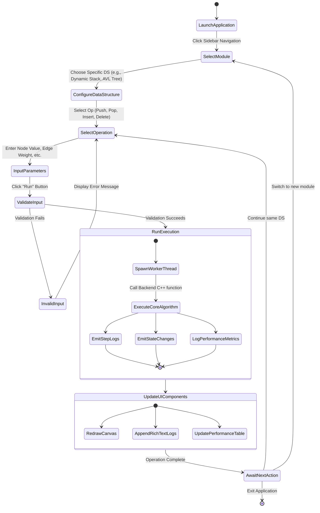
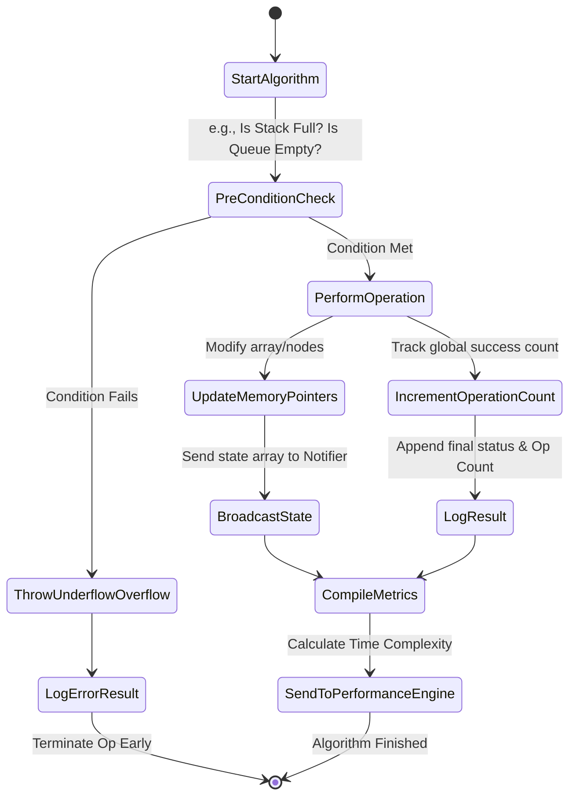

# Activity Diagrams for CDSIAS

This document contains the Activity Diagrams illustrating the typical workflow and user interactions within the **Complete Data Structures Implementation & Analysis System (CDSIAS)**.

## High-Level User Session Workflow
This diagram represents the step-by-step activity flow from the moment the user launches the application to executing a data structure operation.

---

## Detailed Backend Execution Activity
This diagram dives deeper into how a specific core algorithm execution behaves internally.

