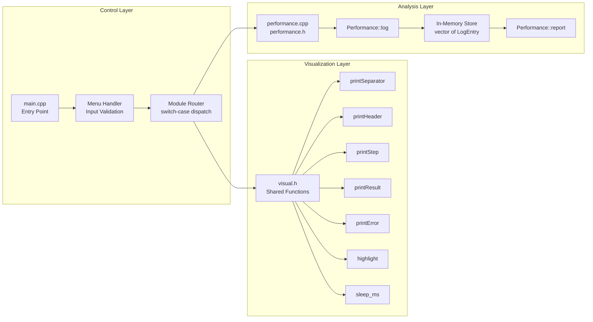
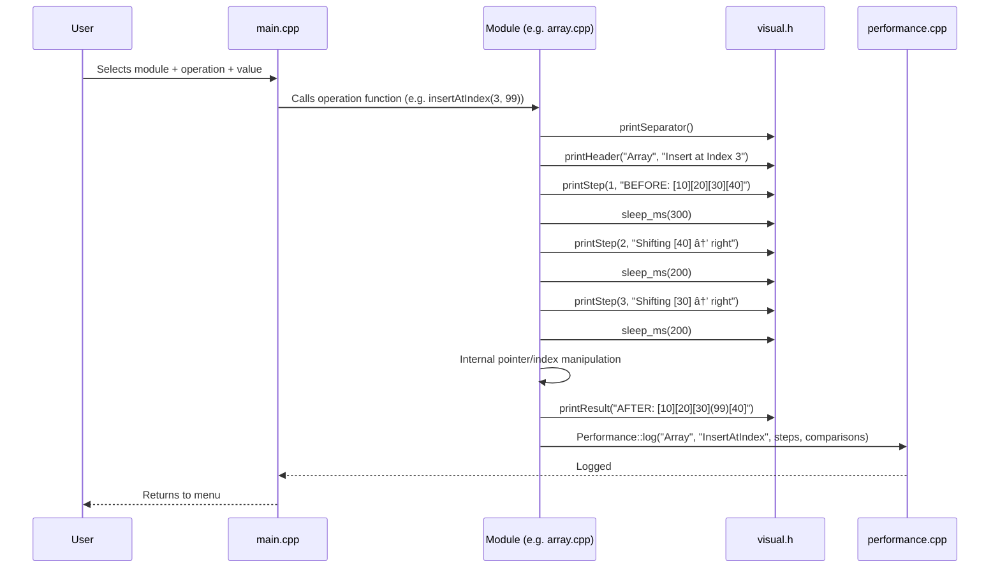
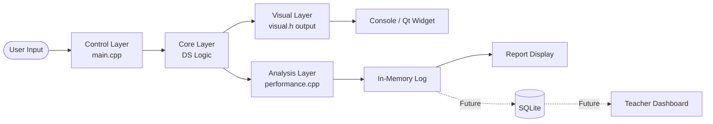
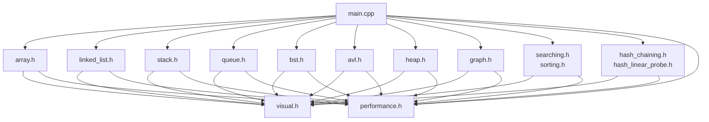
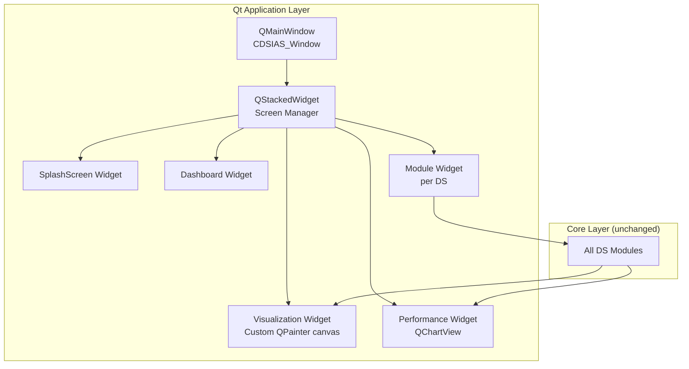
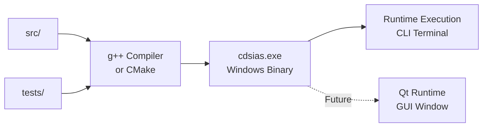

# CDSIAS — System Architecture Document

## architecture.md

---

## 1. HIGH-LEVEL SYSTEM ARCHITECTURE

The system is divided into 5 clean, non-overlapping layers. Each layer has one responsibility. No layer talks to a layer it shouldn't.

```mermaid
graph TD
    subgraph CONTROL["🎮 CONTROL LAYER — main.cpp"]
        MENU[Menu Controller]
        NAV[Module Navigator]
    end

    subgraph VISUAL["🎨 VISUALIZATION LAYER — visual.h"]
        CLI[CLI Renderer]
        ANIM[Animation Engine - sleep_ms]
        FMT[Output Formatter]
    end

    subgraph CORE["⚙️ CORE LAYER — src/core/"]
        LINEAR[Linear DS\nArray · SLL · DLL · CLL]
        SQ[Stack & Queue\nStatic · Dynamic · Circular · Priority · Deque]
        TREE[Trees\nBT · BST · AVL · Heap]
        GRAPH[Graph\nBFS · DFS · Dijkstra · MST]
        SS[Searching & Sorting\nLinear · Binary · Bubble · Merge · Quick · ...]
        HASH[Hashing\nChaining · Linear Probe]
    end

    subgraph ANALYSIS["📊 ANALYSIS LAYER — src/analysis/"]
        PERF[Performance Logger\nperformance.cpp]
        REPORT[Report Generator]
    end

    subgraph DATA["ðŸ-„️ DATA LAYER — Future"]
        SQLITE[(SQLite DB)]
    end

    subgraph GUI["🖥️ GUI LAYER — Future Qt"]
        QTWIN[Qt Main Window]
        QTANIM[Qt Animation Engine]
        QTCHART[Qt Charts]
    end

    MENU --> NAV
    NAV --> LINEAR & SQ & TREE & GRAPH & SS & HASH
    LINEAR & SQ & TREE & GRAPH & SS & HASH --> CLI
    LINEAR & SQ & TREE & GRAPH & SS & HASH --> PERF
    CLI --> ANIM --> FMT
    PERF --> REPORT
    REPORT --> SQLITE
    QTWIN --> LINEAR & SQ & TREE & GRAPH & SS & HASH
    QTANIM --> QTWIN
    QTCHART --> REPORT
```



---

## 2. DETAILED LAYER ARCHITECTURE



---

## 3. CORE LAYER — MODULE DEPENDENCY MAP

```mermaid
graph TD
    CORE[Core Layer\nsrc/core/]

    CORE --> LIN[linear/]
    CORE --> SQ[stack_queue/]
    CORE --> TR[trees/]
    CORE --> GR[graph/]
    CORE --> SORT[searching_sorting/]
    CORE --> HASH[hashing/]

    LIN --> ARR[array.cpp / array.h]
    LIN --> SLL[linked_list.cpp\nSinglyLinkedList]
    LIN --> DLL[linked_list.cpp\nDoublyLinkedList]
    LIN --> CLL[linked_list.cpp\nCircularLinkedList]

    SQ --> STKS[stack.cpp\nStaticStack]
    SQ --> STKD[stack.cpp\nDynamicStack]
    SQ --> QUE[queue.cpp\nSimpleQueue]
    SQ --> CQ[queue.cpp\nCircularQueue]
    SQ --> PQ[queue.cpp\nPriorityQueue]
    SQ --> DQ[deque.cpp\nDeque]

    TR --> BT[binary_tree.cpp]
    TR --> BST[bst.cpp]
    TR --> AVL[avl.cpp]
    TR --> HEAP[heap.cpp\nMinHeap · MaxHeap]

    GR --> GREPR[graph.cpp\nAdjList · AdjMatrix]
    GR --> BFS[bfs.cpp]
    GR --> DFS[dfs.cpp]
    GR --> DIJ[dijkstra.cpp]
    GR --> MST[mst.cpp\nKruskal · Prim]

    SORT --> SRCH[searching.cpp\nLinear · Binary]
    SORT --> BUBBLE[sorting.cpp\nBubble]
    SORT --> SEL[sorting.cpp\nSelection]
    SORT --> INS[sorting.cpp\nInsertion]
    SORT --> MERGE[sorting.cpp\nMerge]
    SORT --> QUICK[sorting.cpp\nQuick]

    HASH --> CHAIN[hash_chaining.cpp]
    HASH --> LP[hash_linear_probe.cpp]
```



---

## 4. USER FLOW DIAGRAM

```mermaid
flowchart TD
    START([System Launch]) --> SPLASH[Splash Screen\nCDSIAS — Data Structure Visualizer]
    SPLASH --> DASH[Main Dashboard\n8 Module Buttons]

    DASH --> M1[Linear Structures]
    DASH --> M2[Stack & Queue]
    DASH --> M3[Trees]
    DASH --> M4[Graph Algorithms]
    DASH --> M5[Searching & Sorting]
    DASH --> M6[Hashing]
    DASH --> M7[Performance Reports]
    DASH --> EXIT([Exit])

    M1 --> M1OP[Select Structure\nArray · SLL · DLL · CLL]
    M1OP --> M1ACT[Select Operation\nInsert · Delete · Search · Display]

    M2 --> M2OP[Select Structure\nStack · Queue · CircQ · PriorQ · Deque]
    M2OP --> M2ACT[Select Operation\nPush·Pop · Enqueue·Dequeue · etc]

    M3 --> M3OP[Select Tree\nBT · BST · AVL · Heap]
    M3OP --> M3ACT[Select Operation\nInsert · Delete · Traversal · Rotate]

    M4 --> M4OP[Select Algo\nBFS · DFS · Dijkstra · Kruskal · Prim]
    M4OP --> M4ACT[Enter Graph\nNodes + Edges]

    M5 --> M5OP[Select Type\nSearching · Sorting]
    M5OP --> M5ACT[Select Algorithm]

    M6 --> M6OP[Select Method\nChaining · Linear Probe]
    M6OP --> M6ACT[Select Operation\nInsert · Search · Delete]

    M1ACT & M2ACT & M3ACT & M4ACT & M5ACT & M6ACT --> INPUT[Enter Value / Parameters]
    INPUT --> VIZ[Step-by-Step\nVisualization]
    VIZ --> LOG[Performance Logged\nsteps · comparisons · complexity]
    LOG --> RESULT[Show Result Message]
    RESULT --> CONT{Continue?}
    CONT -- Yes --> DASH
    CONT -- Same Module --> M1OP
    CONT -- No --> EXIT
```



---

## 5. OPERATION EXECUTION FLOW (LOW LEVEL)



---

## 6. DATA FLOW DIAGRAM



---

## 7. FILE DEPENDENCY MAP



---

## 8. FUTURE Qt GUI ARCHITECTURE



---

## 9. BUILD ARCHITECTURE



---

## 10. LAYER COMMUNICATION RULES

```
┌────────────────────────────────────────────────────────┐
│  ALLOWED COMMUNICATION PATHS                           │
│                                                        │
│  Control  →  Core         ✅ (call DS operations)      │
│  Core     →  Visual       ✅ (output via visual.h)     │
│  Core     →  Analysis     ✅ (log via Performance::log) │
│  Control  →  Analysis     ✅ (request report)           │
│                                                        │
│  FORBIDDEN PATHS                                       │
│                                                        │
│  Core  →  Control         ❌ (DS logic never calls menu)│
│  Visual →  Core           ❌ (renderer never triggers DS)│
│  Visual →  Analysis       ❌ (output has no logging)    │
│  Analysis → Core          ❌ (logger never calls DS)    │
└────────────────────────────────────────────────────────┘
```

