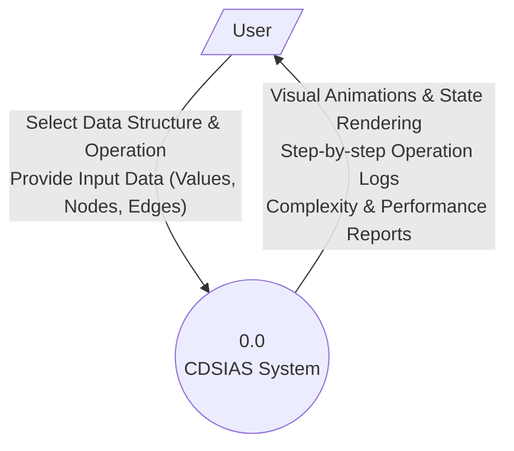
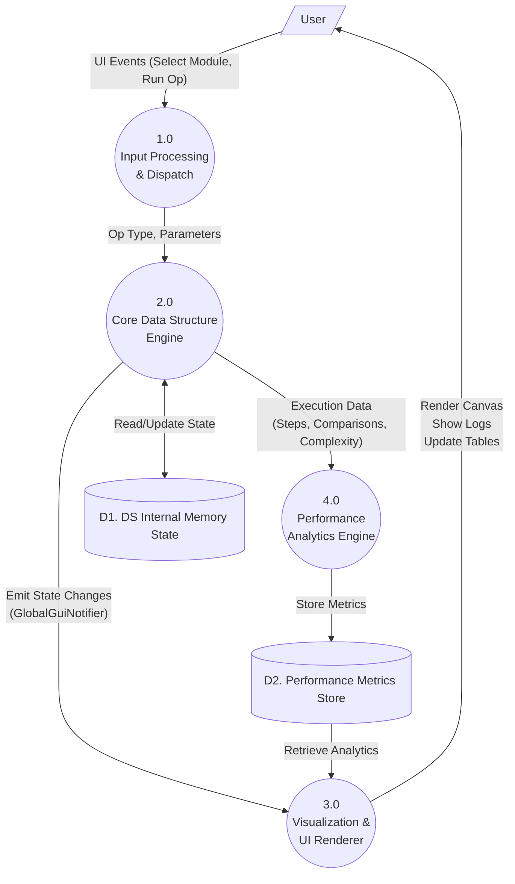
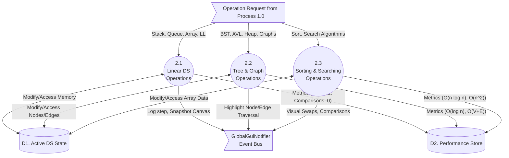
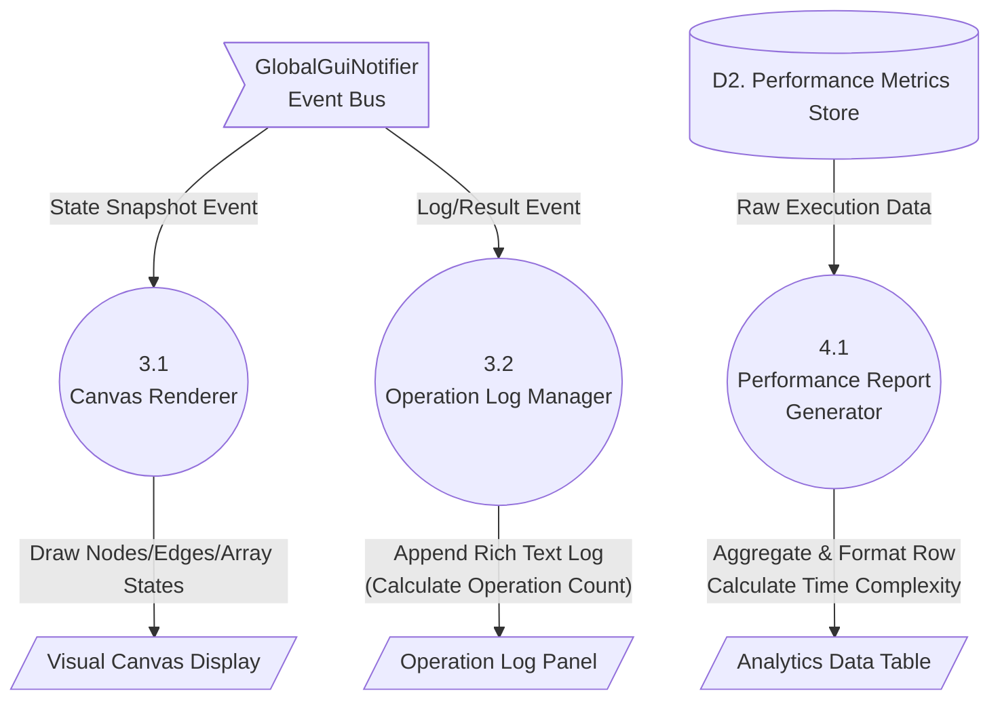

# Data Flow Diagrams (DFD) for CDSIAS

This document outlines the Data Flow Diagrams for the **Complete Data Structures Implementation & Analysis System (CDSIAS)**. These diagrams trace how information flows from the user interface, through the execution engine, and into the visual/analytical outputs.

## Level 0: Context Diagram
The Level 0 DFD (Context Diagram) shows the system as a single high-level process interacting with external entities (the User).

---

## Level 1: System Level DFD
The Level 1 DFD decomposes the system into main functional sub-processes: Input Dispatch, the Core DS Engine, the Visualization Renderer, and the Performance Analytics Engine.

---

## Level 2: Data Structure Engine (Decomposition of Process 2.0)
This level dives deeper into how the Core Engine routes operations to specific algorithm handlers and interacts with the Global Event Bus.

---

## Level 2: Visualization & Reporting System (Decomposition of Processes 3.0 & 4.0)
This diagram details how the event bus updates the specific GUI components and how the performance store generates the final report.

