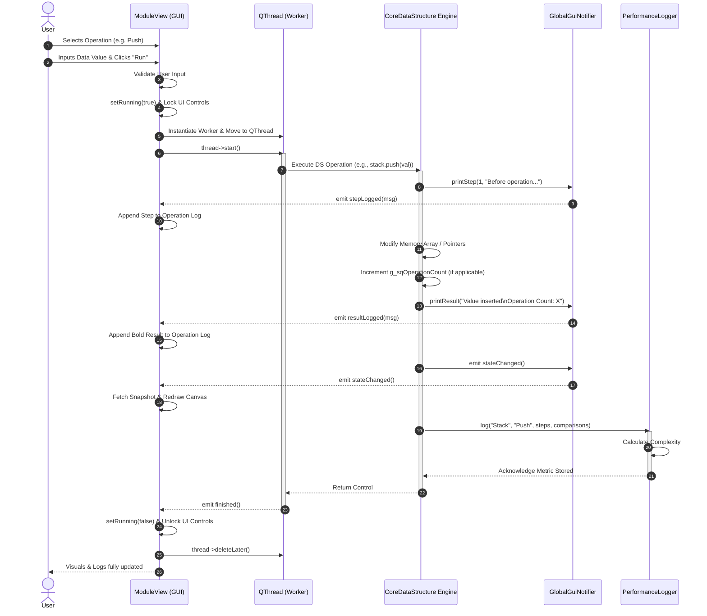
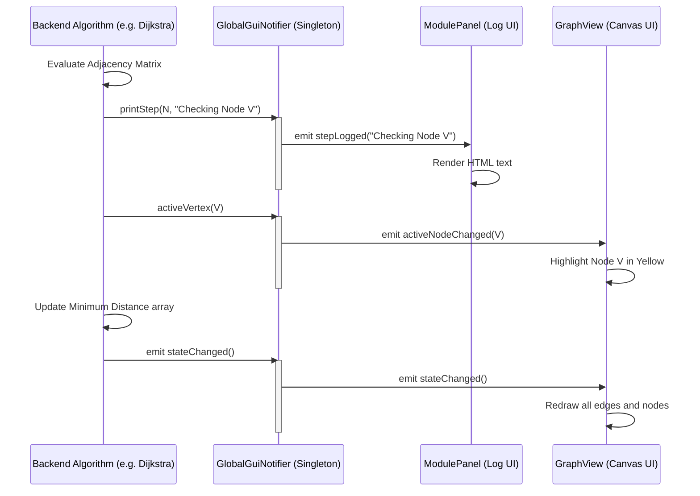

# Sequence Diagrams for CDSIAS

This document contains Sequence Diagrams that map out the chronological interactions between the frontend GUI, multithreaded workers, the global event bus, and the core backend data structures of the **Complete Data Structures Implementation & Analysis System (CDSIAS)**.

## Core Operation Execution Sequence
This diagram illustrates the lifecycle of a single operation (e.g., Push, Enqueue, Insert Edge), showing how the UI spawns a background thread to keep the interface responsive while the C++ backend calculates and emits events.

---

## GlobalGuiNotifier Event Propagation Sequence
This diagram focuses purely on the pub-sub architecture of the system using the Singleton `GlobalGuiNotifier` to decouple the backend engines from Qt UI.

